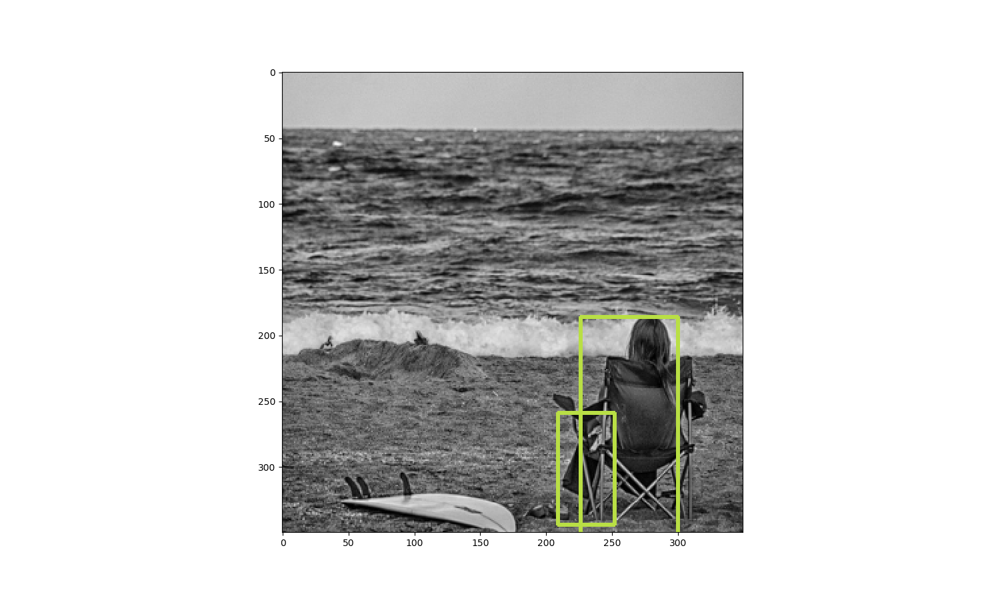
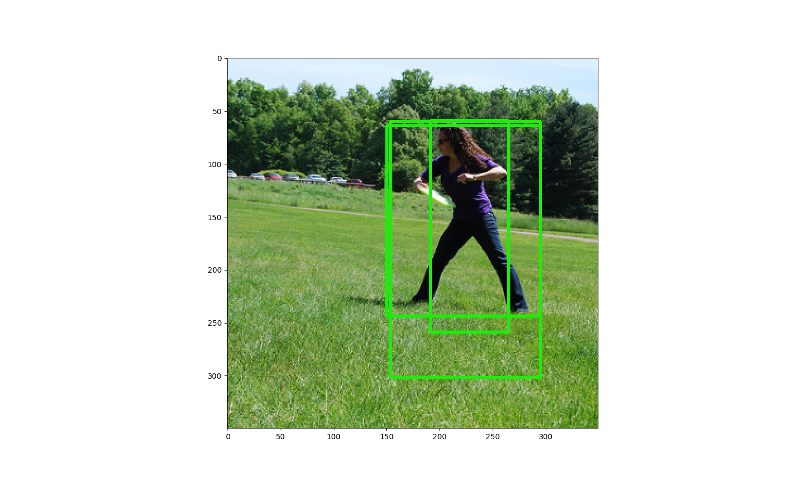

# Yolo-Tensorflow-Implementation
A Yolo object detection implementation in Tensorflow, trainable using Tensorflow optimizers like ADAM. 

# Description 
This Python project is a, from scratch, implementation of a Yolo object detection neural network model in Tensorflow. This implementation consists out of a functioning Yolo model, trainable using the Tensorflow ADAM optimizer on data like the Microsoft COCO dataset. 

# Installation 
Install Python 3.6 with the following Python packages in your environment:
- Ffmpeg v4.0.2
- Matplotlib v2.2.2
- Numpy v1.14.5 (v1.15.1)
- Opencv v3.3.1 (v3.4.1)
- Pandas v0.22.0 (v0.23.4)
- Pycocotools v2.0.0
- scikit-learn v0.19.2 
- sklearn v0.0 
- Scikit-image v0.13.1 
- Scikit-learn v0.19.1 
- Scipy v1.0.1 
- Tensorflow (-gpu) v1.8.0 (v1.10.0) 

Download and unzip the following coco dataset files from http://cocodataset.org/#download:
- annotations_trainval2017.zip (241MB)
- train2017.zip (18GB)

Clone this project and change the file locations of the COCO dataset in the `config.ini` file:
```
[DataSet.coco]
annotation_file = "../COCO/annotations_trainval2017/annotations/instances_train2017.json"
img_dir = "../COCO/annotations_trainval2017/images/train2017/"
```
You are ready to roll!

# Usage 
## Training
Run the Yolo_Training.py program to create and start training a new Yolo model. Train and test results will be displayed while training. The model is stored every epoch in the folder `./models/New Model *time and data*`. 
```
>>python Yolo_Train.py
```
When satisfied with the displayed train and test results during training, could the Yolo_Training.py program just be terminated. The last 5 models, each stored after a finished epoch, are available in the `./models/New Model *time and data*` folder.

## Predicting
A stored model can be used for prediction with the Yolo_Predict.py program. This program will use the stored model to predict objects in a video stream from, for example, a webcam or predict objects in a set of images. Each image or video stream will be displayed with the predicted objects marked using bounding boxes.
```
# using a webcam (press ESC to quit the program):
>>python Yolo_Predict.py "models\model_folder_name\model_name.ckpt"

# using images
>>python Yolo_Predict.py --image "c:\Users\your_name\Pictures" "models\model_folder_name\model_name.ckpt"
````
These are prediction results of a small Yolo model trained with this project for just 12 epochs: 



# performance
This Python project was used to train a Yolo model, defined in config.py, on an Intel i7 set-up with a Nvidia Geforce 750M graphic card. The model was trained on about 65000 Coco dataset images for between 10 and 20 epochs. Results are acceptable but far from perfect because of the following reasons.
- A larger model couldn’t be trained on my set-up because of the limited amount of available memory.
- Further tuning of the models hyper parameters and increasing the model size is required to improve precision and recall.
- Filtering of the predictions has to be further implemented like a non-max suppression algorithm.
- Only a limited amount of data augmentation is currently implemented.

The following settings in the `config.ini` file could be optimized to boost model precision and recall in a relative simple way:

The model hyper parameters could be tweaked in the `[Model] definition` parameter, like by adding layers and increasing filter depths.

The Yolo model input image size could be increased in parameter `[Model.input] input_img_shape`. (The project will resize the images automatically)

The Yolo output cell grid size could be tweaked in parameter `[Model.output] yolo_outp_cell_grid_size`. The set size should match the input image size by making sure the image size is dividable by the output cell grid size:
- Image size (640, 480) and yolo output size (10, 10) is correct.
- Image size (640, 480) and yolo output size (10, 9) is not correct.

The anchor box specification (the to be predicted object widths and heights) should match the bbox sizes of the dataset as close as possible. This anchor box specification is optimized automatically on the given dataset (Coco dataset in this case) according to the following parameters:

|[Model.tune]||
| --- | --- |
|`anchors_max`|Sets the maximum amount of allowed anchors. (a value of 10 would make sense)|
|`anchor_min_iou_gain`|Sets the minimum amount of gained result per added anchor box, to keep adding anchor boxes to the anchor box specification. The result is determined by computing the average IOU between the anchor boxes and the bboxes from the dataset. When the last IOU minus the second to last IOU is more than ‘anchor_min_iou_gain’, shall one more anchor box be added to the specification and this routine repeated. (a value of 0.01 would make sense)|
|`anchor_min_iou`|Sets the minimum IOU which has to be reached, before the optimization quits on the ‘anchor_min_iou_gain’ parameter. (a value of 0.45 would make sense)|

The IOU between the dataset bboxes and anchors is displayed during the Yolo_Train.py program initialization as ‘bbox over anchor IOU: 0.53’. This IOU should be around or higher than 0.5.

At last should the learning rate and learning rate decay in parameter `[Train.learn] learn_rate` and `[Train.learn] learn_rate_dacay_factor` be fine-tuned. Note that a to large learning rate can result in `NaN` loss values and corrupt the model.

# abbreviations
- `bbox` Bounding Box, specifies a box around an object and it's class.
- `IOU` Intersection Over Union, is a metric to measure overlap between two areas.
- `Yolo` You Only Look Once, is the Neural Network model on which this project is based.

# Reference
- Yolo v1 paper    https://arxiv.org/pdf/1506.02640.pdf
- Yolo v2 paper    https://arxiv.org/pdf/1612.08242.pdf
- Tensorflow    https://www.tensorflow.org/
- Coco dataset  http://cocodataset.org/

# Contribution
All contributions, requests and questions are more than welcome. Please share your comments as an [issue](https://github.com/RobbertBrand/Yolo-Tensorflow-Implementation/issues/new) to inform us.

# Thanks
Special thanks to [Jaap Versteegh](https://github.com/jrversteegh) who reviewed the project code.

# License
[License](./LICENSE)
